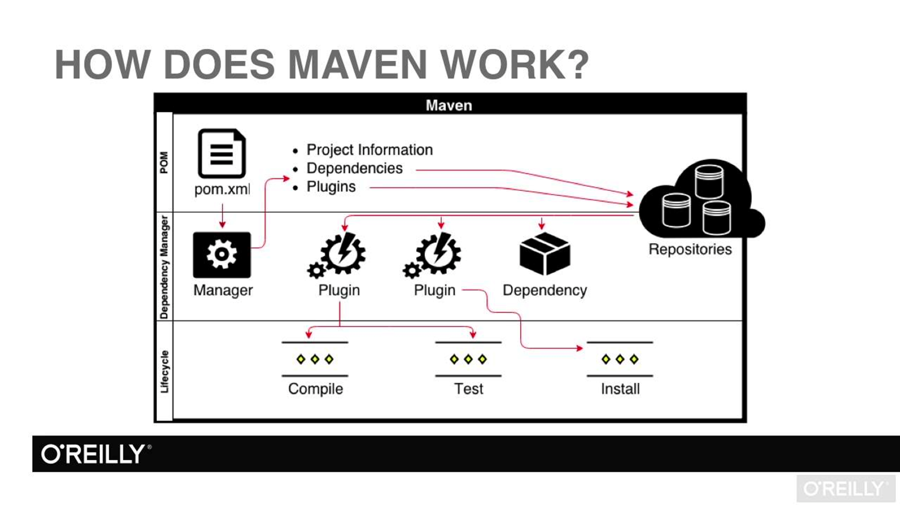
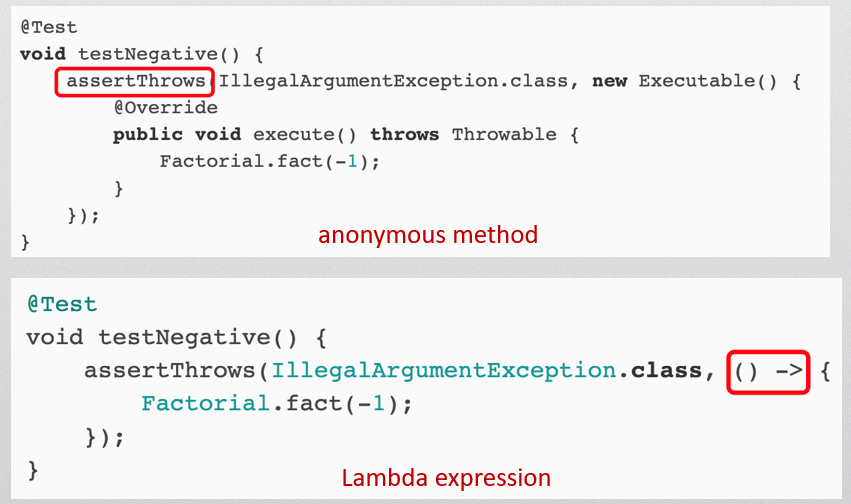

# 
Chapter2  Java Advance Features

## 1. Stream and IO
+ Streams(流)，文件输入输出的方式
+ Java IO classes
    + 字节输出/输入
       
    + 字符输出/输入
    
+ FileInputStream and FileOutputStream(字符I/O)
+ FileReader adn FileWriter
+ **Try-with-resource**
使用try语句释放资源（一些JVM无法释放的资源）。在使用数据库时常常使用。
+ Load files in classpath

## 2. Generics 泛型

## 3. Reflection 反射（重要）
+ Get Class objects(获取Class类的对象)，有三种方法
+ Field：字段类。
区分getField()与getDeclaredFields()
+ 读取与写对象的私有对象
nameField.setAccessible(true)
+ 获取方法对象（Method）
+ 使用reflection创建对象

## 4. Annotation 注解
+ 作用
1. 编写文档：通过代码里标识的元数据生成文档。
2. 代码分析：通过代码里标识的元数据对代码进行分析。
3. 编译检查：通过代码里标识的元数据让编译器能实现基本的编译检查
+ 可以使用reflection得到注解。
    + isAnnotationPresent()方法
    + getAnnotation()方法

## 5. Maven 项目管理工具
+ 作用
1. 提供标准化的文件结构
2. 提供标准的项目构建流程
3. 对于依赖进行管理
+ pom.xml:项目描述文件，重要。
+ pom.xml文件中的scope指的是此依赖使用的阶段，如compile、test等。
+ how does maven work?

## 6. Unit Testing 单元测试
+ JUnit
assert: 测试断言。用于判断测试结果是否正确
+ Fixture
+ Test for exceptions
测试函数是否能正常抛出异常。使用assertThrows()与lambda expression（lambda表达式，用于匿名方法）