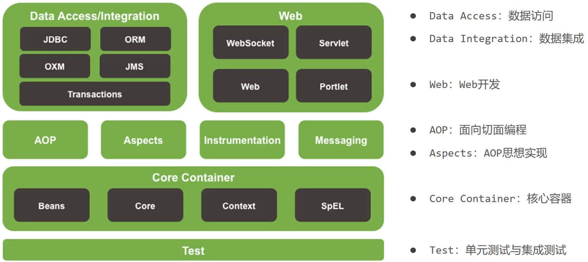
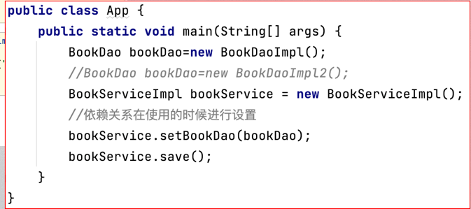
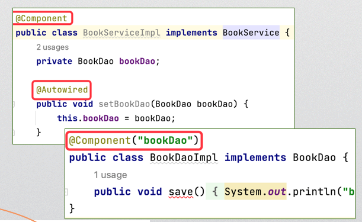

[TOC]
# 
Chapter3  Spring Core

## 1. Introduction to Spring
+ Spring Ecosphere
1. Spring Framework(the core framework,the basis)
2. SpringBoot(重点，简化开发)
3. SpringCloud
+ Architecture of Spring

## 2. Spring IOC（控制反转）
+ Tight-couple programming（紧耦合式的编程）
面向对象原则之――――开闭原则（对于功能扩展开放，对于代码修改封闭）
+ Loose-coupled programming（松耦合） 

在类之外，使用其他方式为对象赋值（例如上图中的setBookDao()方法）

+ IOC（控制反转）

## 3. Spring
+ create a Spring project with Maven

## 4. Lifecycle of Beans
1. Scope of Beans
  + scope="singleton"(default)（一般用这种）
  + scope="prototype"
2. Instantiation with Factory（使用工厂进行实例化）
3. init-method and destroy-method
init-method：初始化bean时的操作
destroy-method：bean被销毁前的操作
4. Initializing and DisposableBean

## 5. Dependency Injection
1. Dependency Injection with Setter
常用的方式，设置set方法，使用setter注入
2. Dependency Injection with Constructor
3. Injection for Collections
4. Autowired Injection By Type
5. Autowired Injection By Name

## 6. IOC Containers

## 7. Spring Annotations
+ Spring with annotations 

@Component 之后若无参数，则默认将其下的类名为bean的id