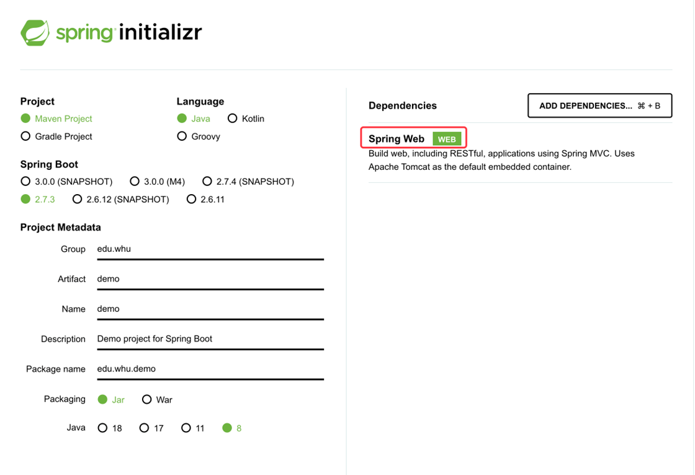
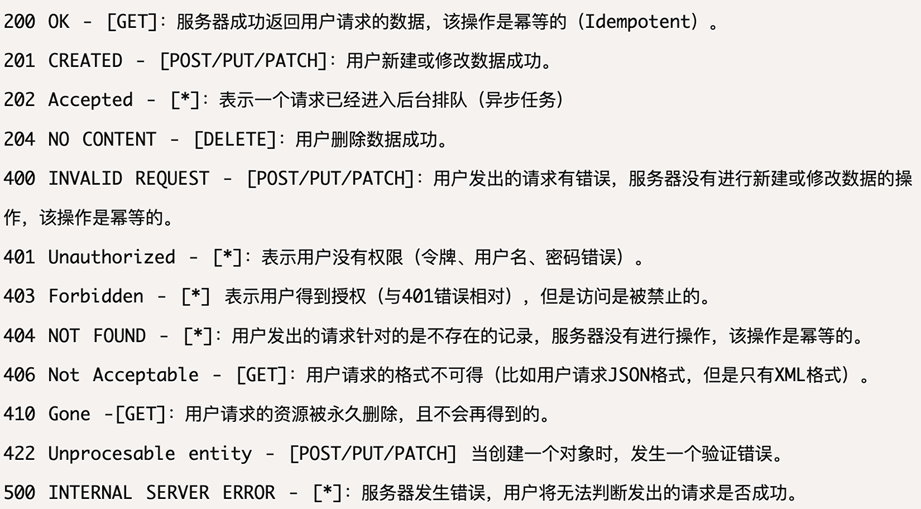
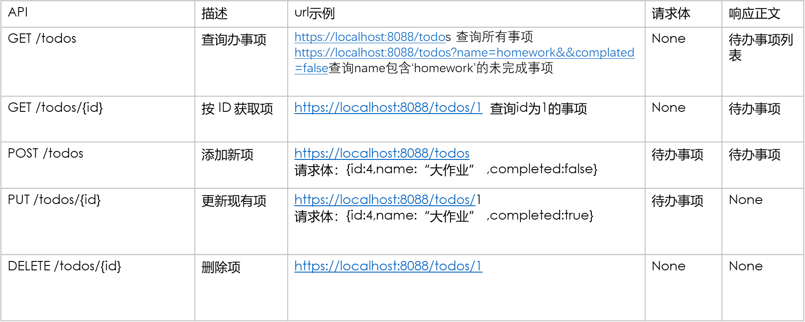
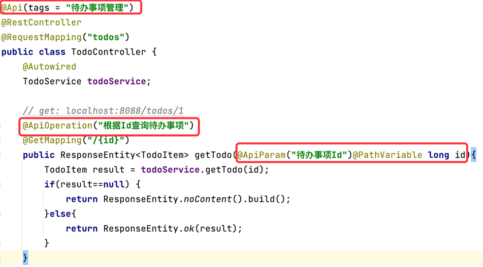

# 
 Chapter4 Spring Boot 

## 1. Web App Basics
+ SPA(Single Page Application)
Front and back-end codes are separated
前端为一些静态资源如html页面、css、javascript等，后端为Web API、数据库等

## 2. Hello,Spring Boot
1. A framework to Simplify Spring application development.（用于简化开发的框架）
+ 内嵌Tomcat等服务器
+ 简化Maven配置

2. 创建SpringBoot Project
Create with Spring Initializr (https://start.spring.io/), download the generated source code, and open it with IDEA

3. SpringBoot 配置文件
+ application.properties
+ application.yaml

## 3. Restful API
1. @RestController for Restful API
+ @Controller is to build a controller in traditional MVC, it is responsible for the page-jump logic and return the model object to render HTML at server side.
+ @RestController is to build a Restful API, and it returns data to front-end, instead of responsible for page-jump logic.

2. Restful API: 通过路由的方法，找到具体的方法
HTTP Method
 

3. Restful API 的状态码

 常见：200：OK  500
 

4. APIs

 

5. Lombok
Lombok
简化java代码的工具.
https://hezhiqiang8909.gitbook.io/java/docs/javalib/lombok
@Data：可以提供默认的 getter/setter 方法
注：还需要在IDEA中安装相应插件
 

6. RestController class
    1. 在Controller类前加上注解@RestController，声明一个restful API
    2. @RequestMapping注解用于通过url定位到对应的类与方法
    3. @**Mapping注解：定位到各个方法

+ 注：在@RequestMapping注解处加上basic path，以防止多个controller混淆路径

7. 几种API方法的实现
    1. Get API
    + Path Variable(路径变量): parameter in path。eg. {id}中的id
    + 一般用id才用路径参数。路径参数不可乱用
    + 返回值使用封装好的ResponseEnitity<>（泛型），返回对应的具体状态码
    + Query Parameter（查询参数）：the parameters in the form of "queryName=value". No annotaion is required.
     

    2. POST API
    + 反序列化（RequestBody）:
    @RequestBody: the parameter is deserialized from the request body(从json中的文本转为对应对象)
     

    3. PUT API
     
    
    4. Delete API
    delete方法无请求体

## 4. Swagger
1. Swagger Annotations

可通过注解添加文本信息、注释

## 5. Vue + Rest API 

