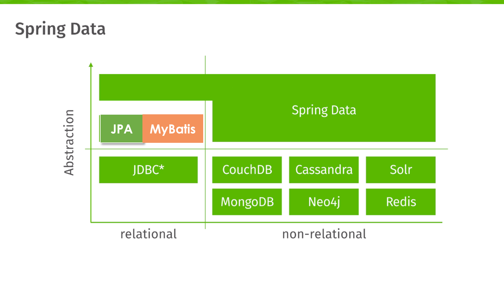
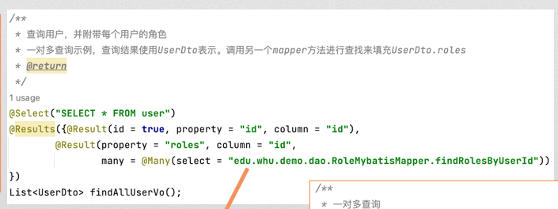
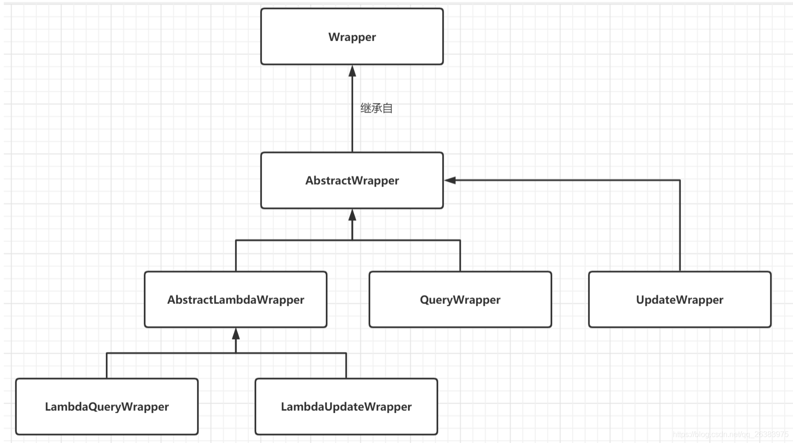
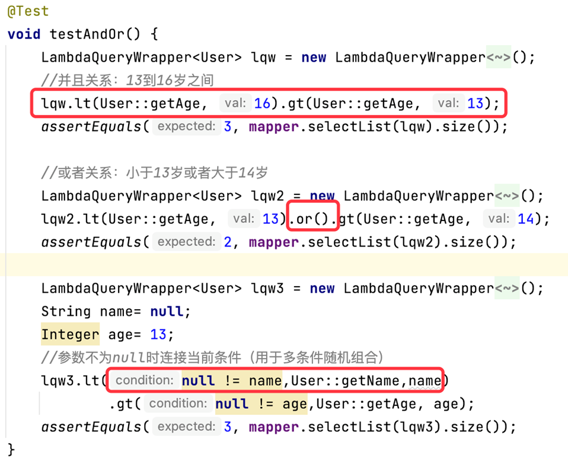
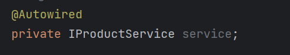
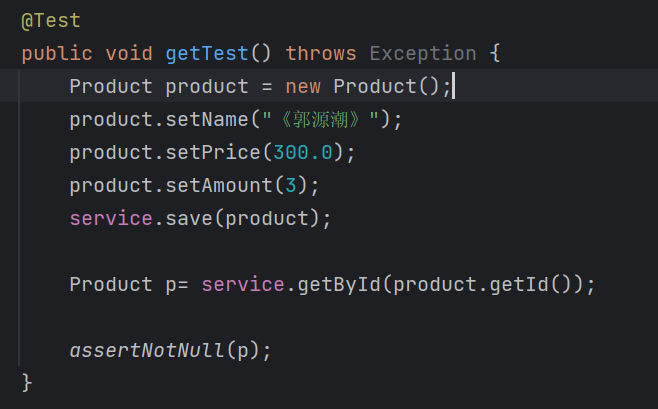
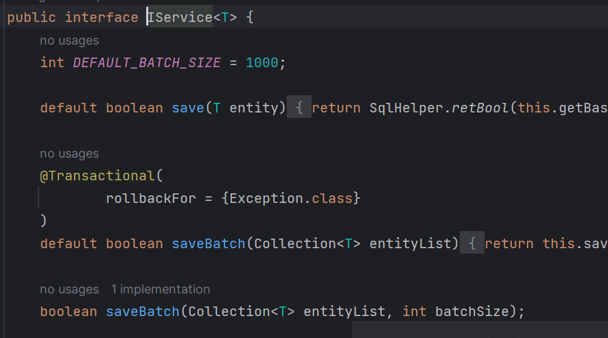
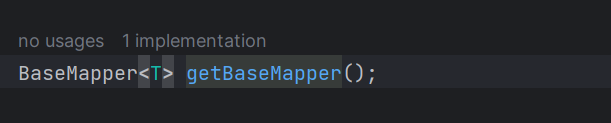
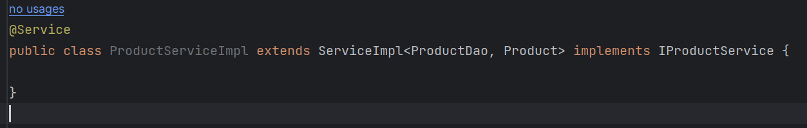
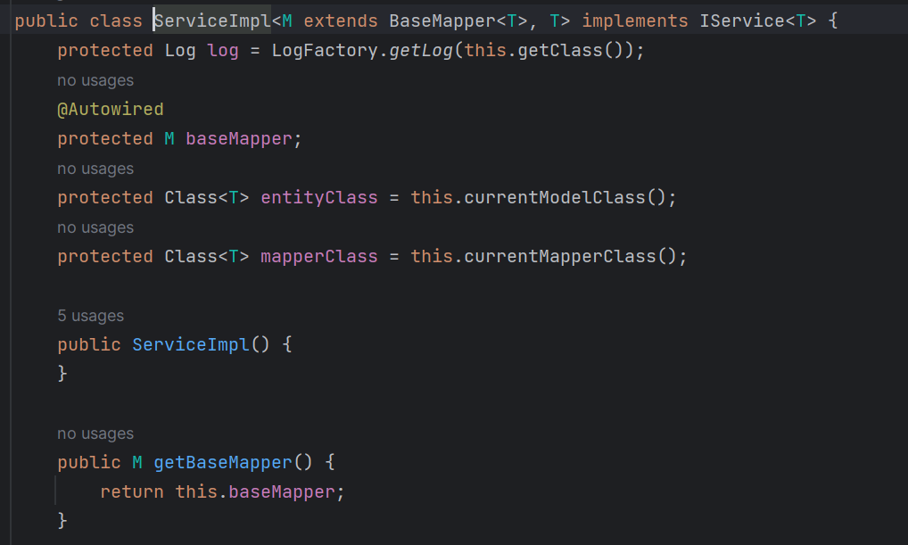

# 
Chapter5 Spring Core

## 1. Spring Data
+ Spring Data
 

 
    1. MongoDB是一个基于分布式文件存储的数据库
    2. Neo4j是一个图形数据库，它将结构化数据存储在网络上而不是表中
 
+ Object Relational Mapping (ORM)
ORM映射框架将对象与数据库表中的字段建立起映射关系

## 2. Mybatis
+ Mybatis: 一个常用的ORM框架
目前常用的为Mybatis with annotations。在Mapper类上加上@Mapper注解
 
+ Auto-generated ID
实体类之上加上@TableId(type = IdType.AUTO)，可以实现主键id的自动生成。同时，需要在对应使用相关实体类的方法之上加上@SelectKey注解
 
+ @Insert @Delete @Update @Select
用于在进行增删改查的操作的方法上添加
 
+ 一对多查询(One-to-many Query)
一对多的查询中，查询结果使用特殊的类表示，需要调用另一个mapper方法进行查找来填充其中的“多数”成员，并且使用@Result注解与@Many注解。
 

## 3. Mybatis-plus
+ Mybatis-plus is an extension to Mybatis, to simplify Mybatis.
    1. All features of Mybatis are kept
    2. Built-in Mapper for CRUD without SQL
    3. Build-in Pagination
    4. Easy-to-use QueryWrapper
    5. Code generator for DB-frist development
 
+ BaseMapper for CRUD(Create,Read,Update,Delete)
在BaseMapper类中已经含有很多对于数据库进行操作的函数，例如insert()、delete()、selectById()等。
创建自己的Mapper类时，需要继承BaseMapper类
 
+ QueryWrapper(重要)
QueryWrapper是mybatis plus中实现查询的对象封装操作类，可以封装sql对象，包括where条件，order by排序，select哪些字段等等，他的层级关系如下：
 

 
其中LambdaQueryWrapper常用。
 
    1. Composite Condition
     
    
     
    2. Aggregation(聚合函数)
    3. Grouping
    4. Paging and sorting
     
+ Entity Annotations

## 4. Code generation
+ Code generation with Mybatis-plus 
Mybatis-plus has a tool to generate code according to the database 
(需要装一些依赖)
 
+ Code Generator
注意：需要手动加上@Mapper！

## 5. Transaction(事务)
+ Database transaction
    1. Atomicity
    2. Consistency
    3. Isolation
    4. Durability
 
+ @Transactional

 
 

## 做作业途中笔记
1. 关于使用CodeGenerator自动生成代码后的service与dao的关系
根据ppt上的示例与下图代码，会发现自动生成代码后的接口IProductService类型的对象有一个方法getById()，可以直接进行对数据库的查询操作。
 

<bt>

 

原本的情况下，对数据库的直接操作由DAO层完成，为何这里service层可以直接使用函数查询数据库呢？ 
经过代码分析，找出了getById()的出处，为接口IService:
 

 
getById方法如下，其中涉及到了getBaseMapper方法。本函数真正使用的是该方法返回类型（可知应为BaseMapper类型）的getById方法。:
 

 
其中，有成员方法getBaseMapper()，待实现：
 

 
而实现接口IService的类，便是ProductServiceImpl、SupplierServiceImp继承的类ServiceImpl：
 

 
ServiceImp类中，实现了方法getBaseMapper()，并且加入了成员baseMapper，其由类参数赋值。这里便是Service与DAO联系的地方。所以service可以使用DAO的方法进行数据库操作。
 
