# 
Chapter6 Spring AOP

## 0. 关于上节课的笔记补充
1. DAO：data access object 数据访问对象，用于数据访问，位于web应用开发的下层
2. DAO层需要进行分页

## 1. Aspect Oriented Programming(AOP)
+ 在软件业，AOP为Aspect Oriented Programming的缩写，意为：面向切面编程，通过预编译方式和运行期动态代理实现程序功能的统一维护的一种技术。AOP是OOP的延续，是软件开发中的一个热点，也是Spring框架中的一个重要内容，是函数式编程的一种衍生范型。利用AOP可以对业务逻辑的各个部分进行隔离，从而使得业务逻辑各部分之间的耦合度降低，提高程序的可重用性，同时提高了开发的效率。
+ Separation of Concerns （关注点分离）

+ Cross-cutting concerns(横切关注点)
编程中，对象与对象之间，方法与方法之间，模块与模块之间都是一个个切面。 
+ 对比图：
一般情况：
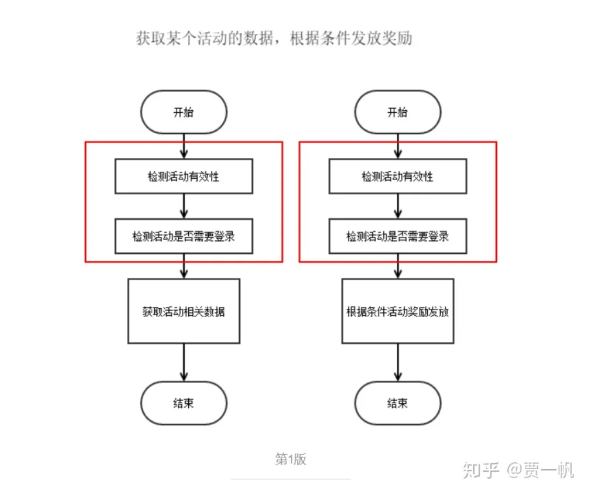
 
面向切面：
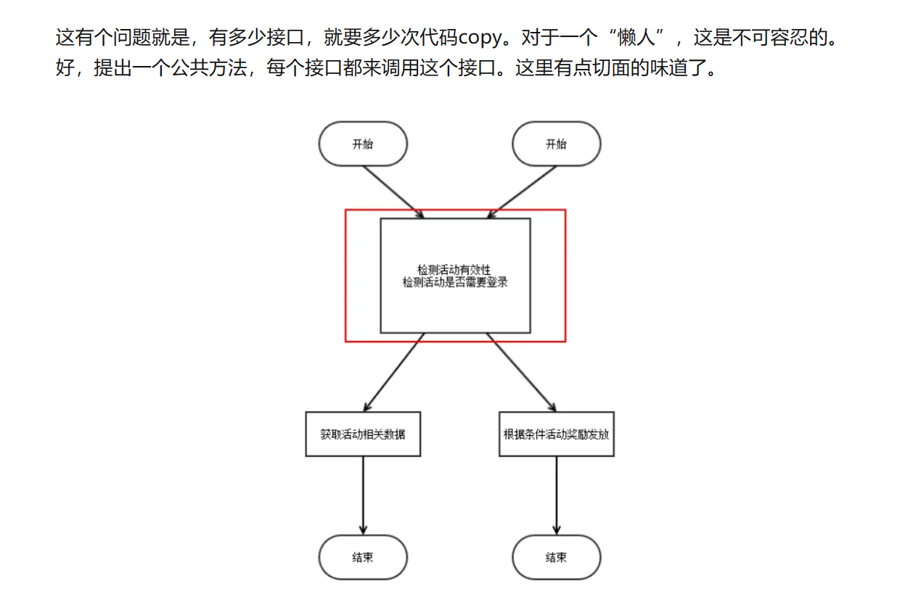
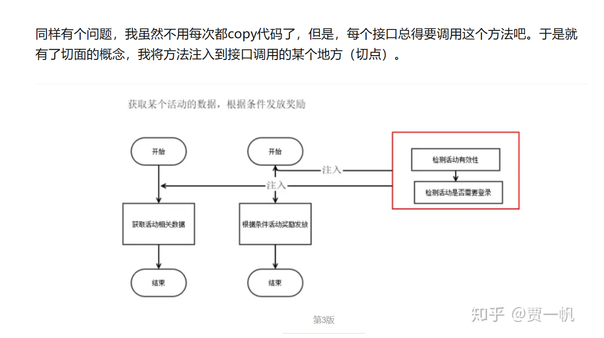

+ 面向切面编程中的相关概念

1. Aspect（切面）： Aspect 声明类似于 Java 中的类声明，在 Aspect 中会包含着一些 Pointcut 以及相应的 Advice。

2. Joint point（连接点）：表示在程序中明确定义的点，典型的包括方法调用，对类成员的访问以及异常处理程序块的执行等等，它自身还可以嵌套其它 joint point。

3. Pointcut（切点）：表示一组 joint point，这些 joint point 或是通过逻辑关系组合起来，或是通过通配、正则表达式等方式集中起来，它定义了相应的 Advice 将要发生的地方。

4. Advice（增强）：Advice 定义了在 Pointcut 里面定义的程序点具体要做的操作，它通过 before、after 和 around 来区别是在每个 joint point 之前、之后还是代替执行的代码。

5. Target（目标对象）：织入 Advice 的目标对象.。

6. Weaving（织入）：将 Aspect 和其他对象连接起来, 并创建 Adviced object 的过程
 

+ 在 Spring AOP 中 Joint point 指代的是所有方法的执行点, 而 point cut 是一个描述信息, 它修饰的是 Joint point, 通过 point cut, 我们就可以确定哪些 Joint point 可以被织入 Advice. 

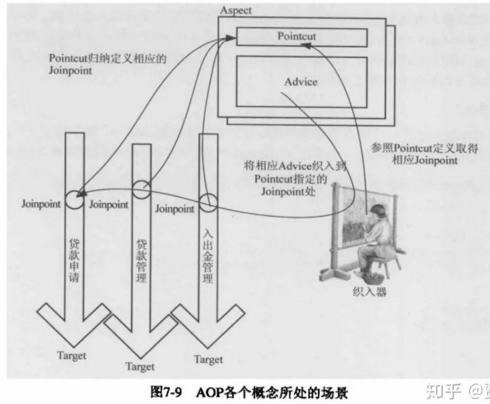
 

## 2. Hello, Spring AOP
 

## 3. How does Spring AOP work?
 

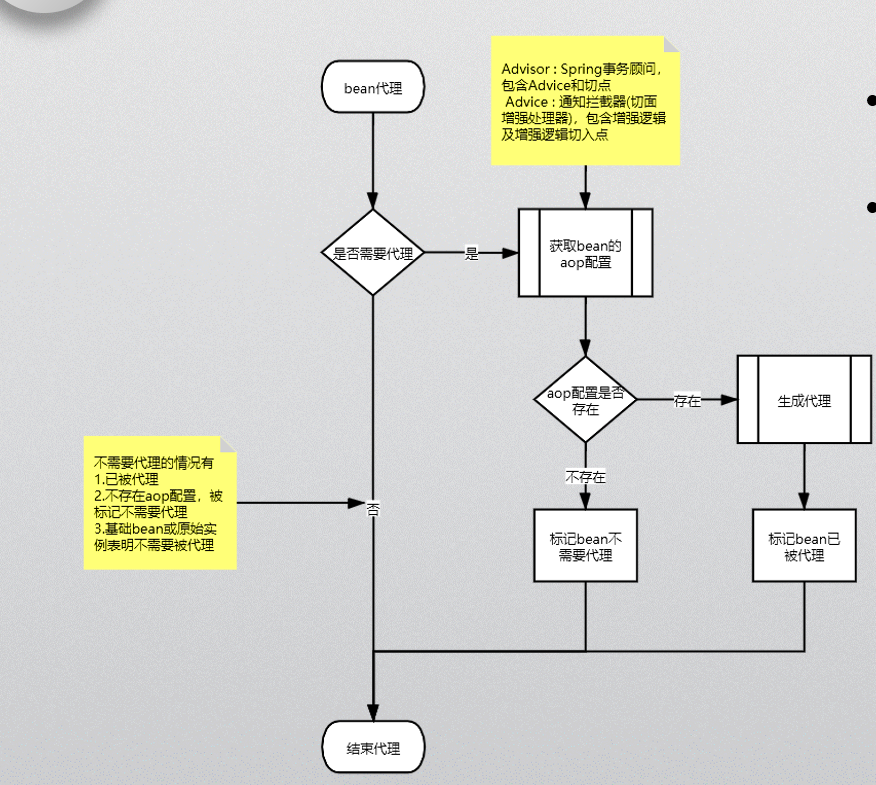
 

## 4. Pointcuts 
+ A pointcut speicifies the joint points (methods) to be weaved
pointcut指定要编织的joint points（方法）

+ Pointcut expressions(表达式)
    1. execution: 通过方法(method)来匹配
     

    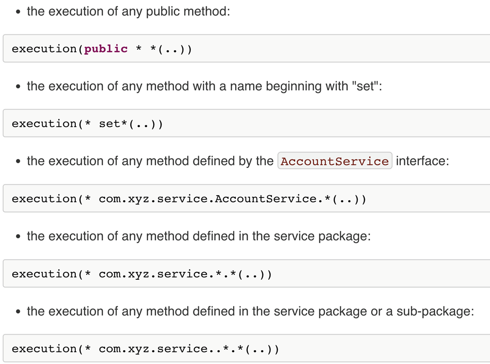
     
    2. within: 通过类来匹配
     

    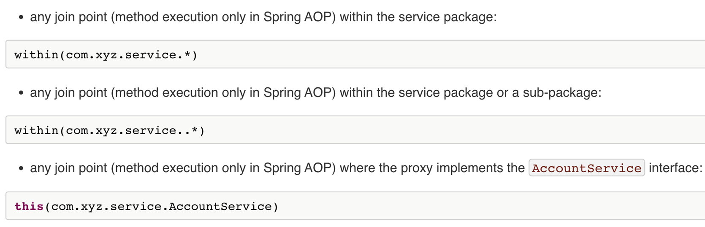
     
    3. this
     
    4. target
     

    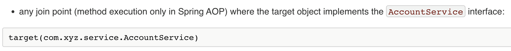

    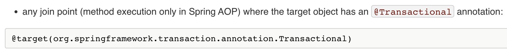
     
    5. args
     
    6. bean：通过bean匹配
     

    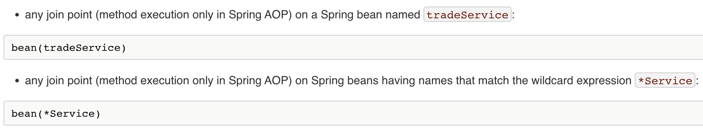
     
    7. @annotation:：通过注解匹配
     

    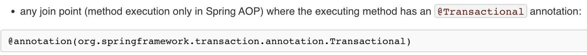
     
    8. @args
     
    
    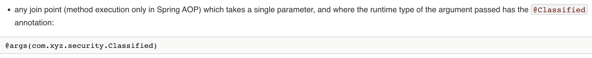
     

## 5. Advices
+ Advice annoations
    1. @Before 
    declares the before advice. It is applied before calling the actual method.
    2. @After 
    declares the after advice. It is applied after calling the actual method and before returning result.
    3. @AfterReturning
    declares the after returning advice. It is applied after calling the actual method and before returning result. But you can get the result value in the advice.（在return结果之前应用，在这个方法中可以获取到返回值（重点！））
    4. @Around 
    declares the around advice. It is applied before and after calling the actual method.
    5. @AfterThrowing
    declares the throws advice. It is applied if actual method throws exception.（抛异常时触发）

## 6. Global Exception Handling（全局异常处理）

+ 注意：全局异常处理函数返回值一定要为ResponseEnitity！

