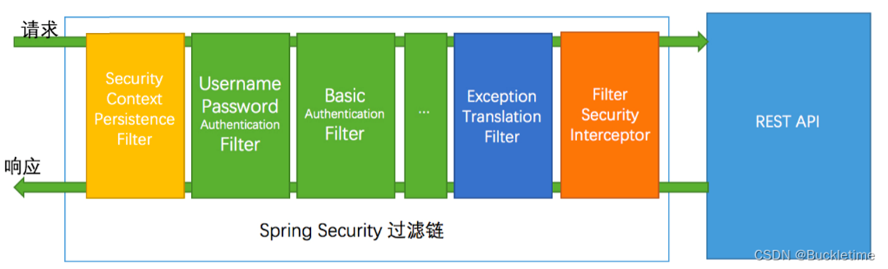

# 
Chapter7 Spring Security

## 1. Spring Security
A polular security framework that secures JavaEE applications
+ Spring Security Filters Chains
 

 

## 2. Basic Authentication（基础的认证）
+ pom.xml中加入依赖

## 3. UserDetailService
+ Authentication Process 

 

+ Two Beans: UserDetailService, PasswordEncoder

+ In-memory UserDetailsService

+ Load user from Database
 

## 4. JWT Authentication
+ Session-based authentication
    1. http 协议本身是无状态的协议，那就意味着当有用户向系统使用账户名称和密码进行用户认证之后，下一次请求还要再一次用户认证才行。因为我们不能通过 http 协议知道是哪个用户发出的请求，所以如果要知道是哪个用户发出的请求，那就需要在服务器保存一份用户信息(保存至 session )，然后在认证成功后返回 cookie 值传递给浏览器，那么用户在下一次请求时就可以带上 cookie 值，服务器就可以识别是哪个用户发送的请求，是否已认证，是否登录过期等等。这就是传统的 session 认证方式。

    2. session 认证的缺点其实很明显，由于 session 是保存在服务器里，所以如果分布式部署应用的话，会出现session不能共享的问题，很难扩展。于是乎为了解决 session 共享的问题，又引入了 redis。
     
+ Token-based authentication(以标记为基础的认证方式)
    1. 这种方式跟 session 的方式流程差不多，不同的地方在于保存的是一个 token 值到 redis，token 一般是一串随机的字符(比如UUID)，value 一般是用户ID，并且设置一个过期时间。每次请求服务的时候带上 token 在请求头，后端接收到token 则根据 token 查一下 redis 是否存在，如果存在则表示用户已认证，如果 token 不存在则跳到登录界面让用户重新登录，登录成功后返回一个 token 值给客户端。

    2. 优点是多台服务器都是使用 redis 来存取 token，不存在不共享的问题，所以容易扩展。缺点是每次请求都需要查一下redis，会造成 redis 的压力，还有增加了请求的耗时，每个已登录的用户都要保存一个 token 在 redis，也会消耗 redis 的存储空间。
     
+ JWT ( JSON Web Token )
    1. 一种认证机制，让后台知道该请求是来自于受信的客户端
    流程描述一下：
        1. 用户使用账号、密码登录应用，登录的请求发送到 Authentication Server。
        2. Authentication Server 进行用户验证，然后创建 JWT 字符串返回给客户端。
        3. 客户端请求接口时，在请求头带上 JWT。
        4. Application Server 验证 JWT 合法性，如果合法则继续调用应用接口返回结果。
 

+ JWT的数据结构，分三个部分 

 

+  JWT authentication with Spring Security (important)

## 5. Cache
+ Why Cache?
The Filter has to loadUser from database for each request, and it will slow down the reponse time of APIs.

+ @EnableCaching注解

+ CacheManager implmentations

 

## 6. Authorization(授权)
+ Role-based Access Control (RBAC)（角色）
